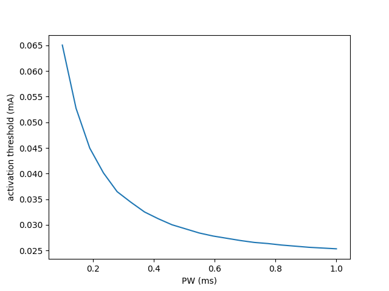

<div align="center">
  
</div>

***
[](https://zenodo.org/doi/10.5281/zenodo.12753670)


Any NEURON model is an optimisation problem.

## 📑 Citation
Hussain, M.A., Grill, W.M., Pelot, N.A., 2024. Highly efficient modeling and optimization of neural fiber responses to electrical stimulation. Nat Commun 15, 7597. https://doi.org/10.1038/s41467-024-51709-8

If you find our work useful, please cite the paper and star ⭐ the repository. Thank you!

## ❗ Requirements

### Hardware requirements
`cajal` requires a standard computer and enough RAM to support the in-memory operations.

### OS requirements
`cajal` has been tested on Windows 11, WSL2 (Ubuntu 22.04 on Windows 11) and Linux (AlmaLinux v9.3, binary-compatible with Red Hat Enterprise Linux).

### Python dependencies

Python 3.8+ (tested on 3.8, 3.9, 3.10). NEURON 7.8+ (tested on 7.8, 8.2). conda (Anaconda / Miniconda). An MPI implementation (OpenMPI, MPICH, Microsoft MPI, etc.) (tested on OpenMPI 2.1.0, OpenMPI 4.0.4, OpenMPI 4.1.1, OpenMPI 4.1.2, and Microsoft MPI 10.1). Additional Python package dependencies can be found in requirements.txt.

> [!IMPORTANT]
> To save large amounts of data generated by parallel simulations on distributed system, it is advantageous to have `h5py` built against parallel HDF5. See [here](https://docs.h5py.org/en/latest/mpi.html) and [here](https://accserv.lepp.cornell.edu/svn/packages/hdf5/release_docs/INSTALL_parallel) for instructions.

## 🖥️ Installation

### Windows (not under WSL)
- [Install NEURON](https://nrn.readthedocs.io/en/latest/install/install_instructions.html#windows) using the binary installer.
- Complete steps for "all systems" below.

### All systems (including WSL)
1. Create and activate `conda` environment: `conda create -n cajal python=3.10; conda activate cajal`

2. Clone the repository, and navigate to the cloned repository.

3. [Install `mpi4py`](https://mpi4py.readthedocs.io/en/latest/install.html)

> [!IMPORTANT]
> Check that `mpi4py` has been correctly installed. Run `mpiexec -n 4 python mpitest.py`. If you do not see output like 
>```
> 0 of 4
> 1 of 4
> 2 of 4
> 3 of 4
>```
>(the numbers can be in any order) then it is not properly installed. Try another method from the `mpi4py` [installation documentation](https://mpi4py.readthedocs.io/en/latest/install.html).

4. Install other dependencies: `pip install -r requirements.txt`

5. Build the extensions: `python setup.py build_ext --inplace`

6. Add the cloned repository directory to your `$PYTHONPATH`

🥳 You're set! Import and run NEURON simulations ✅

## 🚀 Usage

Models constructed using `cajal` consist of fibers, sources, and stimulus waveforms.
Sources may be analytic field models (e.g., point sources in a homogeneous medium), or pre-computed extracellular potentials (e.g., extracted from a finite element model). 

`cajal` aims to reduce the amount of boilerplate code required to get models of extracellular electrical stimulation of nerves running in `NEURON`, executing on large numbers of CPUs in parallel, and extract useful information.

For example, to calculate activation threshold for a 71 node 5.7 $\mu m$ MRG[^1] fiber stimulated with a monophasic cathodic 0.2 ms pulse delivered from a point source 0.5 mm from the fiber:

```python
from cajal.nrn import SimulationEnvironment, Backend as N
from cajal.nrn.cells import MRG
from cajal.nrn.stimuli import MonophasicPulse
from cajal.nrn.sources import IsotropicPoint
from cajal.units import mm, um, ohm, cm, mA, ms

N.tstop = 5*ms
N.dt = 0.005*ms

# axon
mrg = MRG(diameter=5.7*um, axonnodes=71) # by default, central node is at origin

# extracellular current source
pointsource = IsotropicPoint(x=0, y=0, z=0.5*mm, rhoe=500*ohm*cm)
stim = MonophasicPulse(amp=-1*mA, pw=0.2*ms, delay=0.5*ms)
electrode = pointsource << stim

# simulation environment
env = SimulationEnvironment([mrg], [electrode])

# calculate threshold
thresh = env.find_thresh()
print(f'Threshold is {thresh:.3f} mA')
```
```bash
> Threshold is 0.044 mA
```

If you want to do many simulations, you could benefit from running them in parallel. Let's calculate thresholds for 21 PWs from 0.1 to 1 ms and plot the strength-duration relationship.

```python
import matplotlib.pyplot as plt
import numpy as np

# -- NOTE: extra imports --
from cajal.mpi import Backend as MPI, Thresholder
from cajal.nrn.specs import Mutable as Mut

from cajal.nrn import Backend as N
from cajal.nrn.cells import MRG
from cajal.nrn.stimuli import MonophasicPulse
from cajal.nrn.sources import IsotropicPoint
from cajal.units import mm, um, ohm, cm, mA, ms

N.tstop = 5*ms
N.dt = 0.005*ms

# fiber and stim declarations are the same apart from adding .SPEC
mrg = MRG.SPEC(diameter=5.7*um, axonnodes=71)

# extracellular current source
pointsource = IsotropicPoint.SPEC(x=0, y=0, z=0.5*mm, rhoe=500*ohm*cm)
# specify pw as Mutable() as will be changing between simulations
stim = MonophasicPulse.SPEC(amp=-1*mA, pw=Mut(), delay=0.5*ms) 
electrode = pointsource << stim

# use Thresholder (which wraps cajal.mpi.MPIRunner) for parallel thresholds
env = Thresholder([mrg], [electrode])

# range of pws
pws = np.linspace(0.1, 1.0, 21)

# calculate thresholds
env.run(pws)

# only plot on master process
if MPI.MASTER():
    plt.plot(pws, env.thresholds)
    plt.xlabel('PW (ms)'); plt.ylabel('activation threshold (mA)')
    plt.show()
```
Then execute in parallel (e.g. on 4 CPU cores):
```bash
# substitute mpirun for mpiexec depending on your MPI implementation
> mpirun -n 4 python parallel_thresholds.py 
```
Voilà:

<div align="center">
  
</div>

These examples and others, including how to perform optimisation of waveforms for selective stimulating using Differential Evolution[^2], are in `./examples/`.

## 📜 License
The copyrights of this software are owned by Duke University. As such, it is offered under a custom license (see LICENSE.md) whereby:

1. DUKE grants YOU a royalty-free, non-transferable, non-exclusive, worldwide license under its copyright to use, reproduce, modify, publicly display, and perform the PROGRAM solely for non-commercial research and/or academic testing purposes.  

2. In order to obtain any further license rights, including the right to use the PROGRAM, any modifications or derivatives made by YOU, and/or PATENT RIGHTS for commercial purposes, (including using modifications as part of an industrially sponsored research project), YOU must contact DUKE’s Office for Translation and Commercialization (Digital Innovations Team) about additional commercial license agreements.

Please note that this software is distributed AS IS, WITHOUT ANY WARRANTY; and without the implied warranty of MERCHANTABILITY or FITNESS FOR A PARTICULAR PURPOSE.


[^2]: Storn, Rainer, and Kenneth Price. 1997. “Differential Evolution – A Simple and Efficient Heuristic for Global Optimization over Continuous Spaces.” Journal of Global Optimization 11 (4): 341–59. https://doi.org/10.1023/A:1008202821328.

[^1]: McIntyre, Cameron C., Andrew G. Richardson, and Warren M. Grill. 2002. “Modeling the Excitability of Mammalian Nerve Fibers: Influence of Afterpotentials on the Recovery Cycle.” Journal of Neurophysiology 87 (2): 995–1006. https://doi.org/10.1152/jn.00353.2001.
